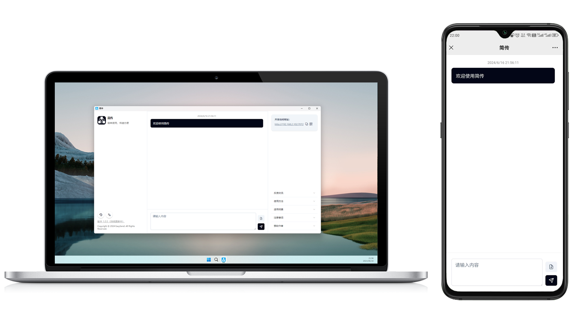

# 简传

#### 介绍
✨一款不需要在接收端安装就可在局域网环境内共享文本及文件的小软件，仅需一台主机电脑启动，需要获取共享的电脑或手机无需安装只需使用浏览器访问即可，欢迎体验  
支持windows、linux、mac，支持国产操作系统多平台

若局域网版简传不满足需求，可试试公网unicloud版简传：https://ext.dcloud.net.cn/plugin?id=19441

#### 软件架构
采用electron-egg + uniapp + primevue ui实现  
官网下载：https://easysend.channer.cn

  

#### 安装教程

1.  安装：npm i
2.  预览：npm run start
3.  开发情况下，前端为单独的uniapp项目，需要使用hbuilderx打开启动，路径为frontend，发行为h5后在项目根目录执行`npm run rd`将打包文件放到electron-egg下
4.  linux-arm下，打包有点小问题，需要使用本机安装的fpm，请看官网文档教程

#### 使用场景

1.  局域网各电脑共享
2.  虚拟机和宿主机共享、多个虚拟机共享
3.  手机电脑共享

#### 特技

1.  无需公网，仅需一端安装即可使用
2.  浏览器访问，使用更便捷
3.  支持一键复制共享地址、支持手机二维码扫描、支持拖拽文件上传、支持图片预览

#### 更新计划

1.  暗黑模式开关，主题颜色等  
2.  自定义文件上传路径

#### 交流反馈

加作者微信进群或QQ群

  
  

#### 赞助
若本工具对你有用，可赞助作者💖

  

#### 赞助鸣谢（排名不分先后）
赞助时可备注自己的昵称，不然只能看到部分，方便这里鸣谢展示  
 *强 **松 *  
