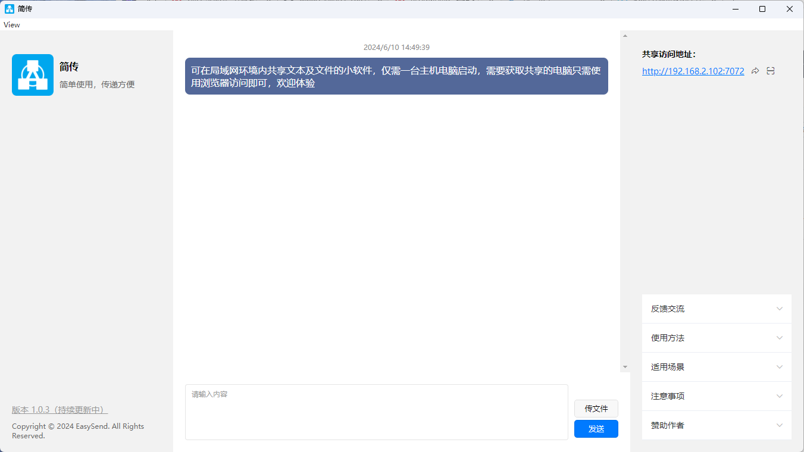

# 简传

#### 介绍
✨可在局域网环境内共享文本及文件的小软件，仅需一台主机电脑启动，需要获取共享的电脑只需使用浏览器访问即可，欢迎体验

#### 软件架构
采用electron-egg + uniapp 实现

#### 安装教程

1.  安装：npm i
2.  预览：npm run start
3.  开发情况下，前端为单独的uniapp项目，需要使用hbuilderx打开启动，路径为frontend，发行为h5后在项目根目录执行`npm run rd`将打包文件放到electron-egg下

#### 使用场景

1.  局域网各电脑共享
2.  虚拟机和宿主机共享
3.  手机电脑共享

#### 注意事项

1.  需将node_modules\ee-core\ee\eeApp.js 第300行改为`host: mainServer.open ? undefined : mainServer.host`，才能默认开放所有人访问（已提交electron-egg合并请求，若合并以后就不需要改了）

#### 特技

1.  无需公网，安装即可使用
2.  浏览器访问，使用更便捷
3.  支持一键复制共享地址、支持手机二维码扫描、支持拖拽文件上传

#### 开发背景

#### 更新计划

1.  mac复制粘贴快捷键不能使用问题
2.  分页数据
3.  删除消息，按文本或者文件分类删除，多选删除，清除缓存等
4.  增加消息频道，隔离不同消息，增强隐私

#### 赞助
若本工具对你有用，可赞助作者💖

